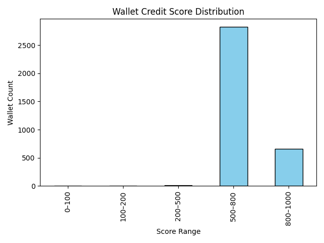
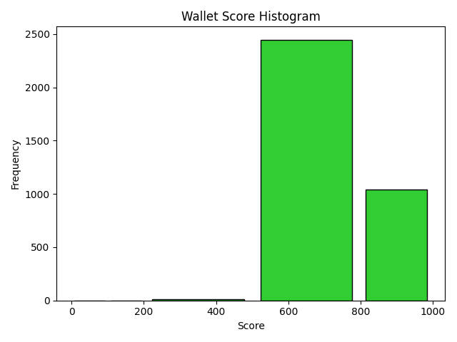

# Wallet Score Analysis

This document provides an analysis of wallet scores generated from Aave v2 transaction data.

## Score Distribution

- **0–100**: Very high-risk, often liquidated, or only borrowing with little repayment
- **100–200**: High-risk users, many borrow actions, few repays
- **200–500**: Some responsible action, occasional risky activity
- **500–800**: Most wallets, fairly balanced, regular deposits and repayments
- **800–1000**: Highly reliable, high deposits, regular repayments, no liquidation calls

| Score Range | Wallet Count | Notable Patterns                       |
|-------------|-------------|----------------------------------------|
| 0–100       | 1          | Heavy liquidations, aggressive borrow  |
| 100–200     | 1          | Many borrows, few repayments           |
| 200–500     | 10          | Mixed repays/deposits, some risk       |
| 500–800     | 2824          | Deposits, repays frequent, steady      |
| 800–1000    | 661          | No liquidations, frequent repayments   |

### Behavioral Patterns
- **Low scores** are associated with wallets that borrowed large sums, rarely repaid, and/or triggered liquidation.
- **Medium scores** indicate activity diversity with some repayments and borrows, occasional risky behavior.
- **High scores** show consistent deposits, repayments, and lack of risky actions.

---

